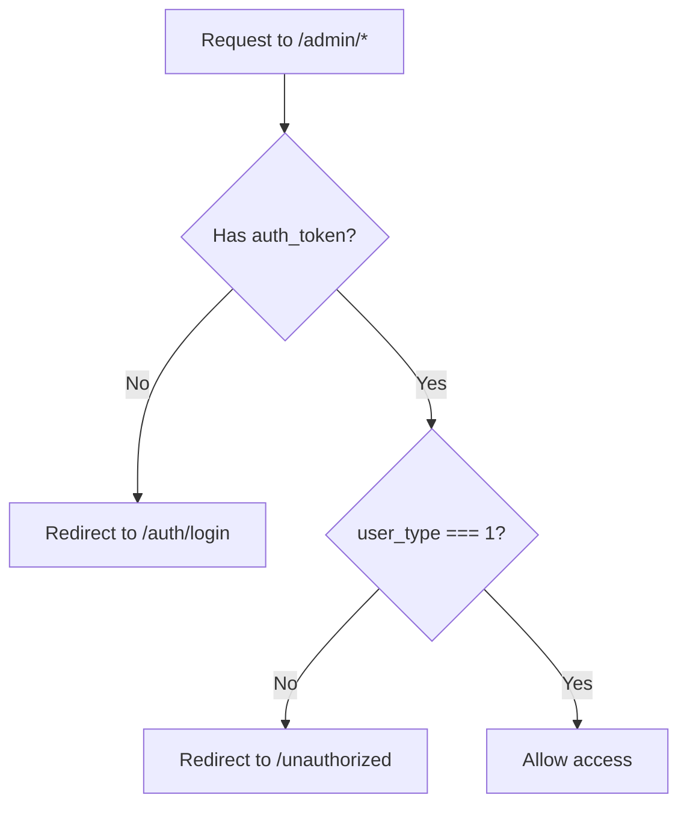

# JuniorPro Project Overview

Welcome to the JuniorPro project! This document provides a comprehensive guide to understanding the project structure, technologies used, and how to develop new features.

---

## 📋 Table of Contents

1. [Technologies & Libraries](#technologies--libraries)
2. [Folder & File Structure](#folder--file-structure)
3. [Authentication System](#authentication-system)
4. [Services Architecture](#services-architecture)
5. [Models & Types](#models--types)
6. [Components](#components)
7. [Configuration System (userConfig)](#️-configuration-system-userconfig)
8. [Working with Tables](#working-with-tables)
9. [How to Implement a New Feature](#how-to-implement-a-new-feature)

---

## 🚀 Technologies & Libraries

### Core Framework & Language

- **[Next.js 15.3.5](https://nextjs.org/)** - React framework with App Router
- **[React 19.0.0](https://react.dev/)** - UI library
- **[TypeScript 5](https://www.typescriptlang.org/)** - Type-safe JavaScript

### Styling

- **[Tailwind CSS 4](https://tailwindcss.com/)** - Utility-first CSS framework
- **[@tailwindcss/forms](https://github.com/tailwindlabs/tailwindcss-forms)** - Form styling plugin
- **[tailwind-merge](https://github.com/dcastil/tailwind-merge)** - Utility for merging Tailwind classes

### UI Libraries & Components

- **[Headless UI](https://headlessui.com/)** - Unstyled, accessible UI components (Dialog, Select, etc.)
- **[Lucide React](https://lucide.dev/)** - Icon library
- **[sonner](https://sonner.emilkowal.ski/)** - Toast notifications
- **[nextjs-toploader](https://www.npmjs.com/package/nextjs-toploader)** - Page loading indicator

### State Management

- **[Jotai](https://jotai.org/)** - Primitive and flexible state management
  - Located in `app/atoms/` directory
  - Provides global state for sidebar, user data, etc.

### Form & Validation

- **[Zod 4](https://zod.dev/)** - Schema validation library
- **[CVA](https://cva.style/)** - Class Variance Authority for component variants

### Animation & Interactions

- **[@formkit/auto-animate](https://auto-animate.formkit.com/)** - Automatic animations
- **[Embla Carousel](https://www.embla-carousel.com/)** - Carousel/slider library
  - With autoplay and wheel gesture plugins

### Utilities

- **[usehooks-ts](https://usehooks-ts.com/)** - TypeScript-ready React hooks
- **[js-cookie](https://github.com/js-cookie/js-cookie)** - Cookie management

### Development Tools

- **ESLint** - Code linting with Next.js and Prettier plugins
- **Prettier** - Code formatting
- **pnpm** - Package manager (v10.13.1)

---

## 📂 Folder & File Structure

```
juniorpro_production/
├── .azure/                    # Azure deployment configurations
├── .github/                   # GitHub workflows and configs
├── .next/                     # Next.js build output (auto-generated)
├── .vscode/                   # VSCode settings
├── app/                       # Main application directory (App Router)
│   ├── (pages)/              # Route groups
│   │   ├── (loged-in)/       # Protected routes for logged-in users
│   │   ├── (logged-out)/     # Public routes
│   │   ├── @modalSlot/       # Parallel route for modals
│   │   ├── auth/             # Authentication pages
│   │   ├── modal/            # Modal routes
│   │   └── style-guide/      # UI component showcase
│   │
│   ├── atoms/                # Jotai state atoms
│   │   ├── index.ts          # Barrel export
│   │   ├── sidebar.ts        # Sidebar state
│   │   └── user.ts           # User state
│   │
│   ├── components/           # Reusable UI components
│   │   ├── client/           # Client-side components
│   │   ├── modals/           # Modal components (feature-based)
│   │   ├── Nav/              # Navigation components
│   │   ├── lib/              # Component utilities
│   │   ├── schemas/          # Validation schemas
│   │   ├── types/            # Component-specific types
│   │   ├── Badge.tsx
│   │   ├── Button.tsx
│   │   ├── Input.tsx
│   │   ├── Modal.tsx         # Base modal component
│   │   ├── Select.tsx
│   │   ├── Table.tsx
│   │   └── ... (other UI components)
│   │
│   ├── config/               # App configuration
│   ├── icons/                # Custom SVG icons
│   ├── lib/                  # App-level utilities
│   ├── server/               # Server-side functions
│   │   ├── lib/              # Server utilities
│   │   ├── types/            # Server-specific types
│   │   ├── getData.ts        # Generic API fetcher
│   │   ├── getFetchHeaders.ts
│   │   ├── getLookup.ts
│   │   └── ... (feature-specific fetchers)
│   │
│   ├── styles/               # Global styles and themes
│   ├── types/                # TypeScript type definitions
│   │   ├── Projects/         # Project-related types
│   │   ├── AddProject.ts
│   │   ├── Calendar.ts
│   │   ├── Career.ts
│   │   ├── LookUp.ts
│   │   ├── Plan.tsx
│   │   ├── ProfileData.ts
│   │   └── index.ts          # Barrel export
│   │
│   ├── utils/                # Utility functions
│   │   └── server/           # Server-specific utils
│   │
│   ├── favicon.ico
│   ├── globals.css           # Global CSS with Tailwind theme
│   └── layout.tsx            # Root layout
│
├── docs/                     # Project documentation (this folder)
├── public/                   # Static assets
├── node_modules/             # Dependencies
├── .env.local                # Environment variables
├── .gitignore
├── eslint.config.mjs         # ESLint configuration
├── middleware.ts             # Next.js middleware (auth/routing)
├── next.config.ts            # Next.js configuration
├── next-env.d.ts             # Next.js TypeScript declarations
├── package.json              # Dependencies and scripts
├── pnpm-lock.yaml
├── postcss.config.mjs        # PostCSS configuration
├── README.md
└── tsconfig.json             # TypeScript configuration
```

### Path Aliases (from `tsconfig.json`)

The project uses path aliases for clean imports:

```typescript
@components     → ./app/components
@icons          → ./app/icons
@public/*       → ./public/*
@lib            → ./app/lib
@server         → ./app/server
@server/lib     → ./app/server/lib
@server/types   → ./app/server/types
@types          → ./app/types
@utils          → ./app/utils
@utils/server   → ./app/utils/server
@styles         → ./app/styles
@components/client → ./app/components/client
@atoms          → ./app/atoms
```

**Example usage:**

```typescript
import { Button, Input } from "@components";
import { getData } from "@server";
import { Project } from "@types";
```

---

## � Authentication System

The JuniorPro project uses **cookie-based authentication** with role-based access control. The authentication system is built with Next.js server actions and middleware.

### Authentication Flow Overview

```mermaid
graph TD
    A[User lands on app] --> B{Has auth_token cookie?}
    B -->|No| C[Redirect to /auth/login]
    B -->|Yes| D{Token valid?}
    D -->|No| C
    D -->|Yes| E{Check user_type}
    E -->|1 - Admin| F[/admin/dashboard]
    E -->|2 - Junior| G[/junior/dashboard]
    E -->|3 - Contributor| H[/contributor/dashboard]
    E -->|4 - PM| I[/project/manager/dashboard]
```

### Core Authentication Files

```
app/
├── (pages)/
│   └── auth/
│       ├── server/               # Server actions for auth
│       │   ├── signIn.ts         # Login logic
│       │   ├── signUp.ts         # Registration logic
│       │   ├── verifyOtp.ts      # OTP verification
│       │   ├── resendOtp.ts      # Resend OTP
│       │   ├── signOut.ts        # Logout logic
│       │   ├── resetPassword.ts  # Password reset request
│       │   └── verifyResetPassword.ts
│       │
│       └── @slot/                # Auth UI routes
│           ├── login/
│           ├── sign-up/
│           ├── verify-otp/
│           ├── reset-password/
│           └── verify-reset-password/
│
├── server/
│   └── getFetchHeaders.ts        # Auth headers for API calls
│
└── middleware.ts                  # Route protection & redirects
```

---

### 1. Sign Up Flow

**File:** `app/(pages)/auth/server/signUp.ts`

Users can sign up as either a **Contributor** or **Junior**.

#### Sign Up Process

1. **User fills form** with firstName, lastName, email, password, role selection
2. **Validation** using Zod schemas (BaseSchema or JuniorSchema)
3. **API call** to `/contributor/sign-up` or `/junior/sign-up`
4. **Store email in cookie** (`signup_email`) for OTP verification
5. **Redirect** to OTP verification page

#### Code Example

```typescript
// Zod validation schema
const BaseSchema = z.object({
  firstName: z.string().min(3),
  lastName: z.string().min(3),
  email: z.string().email(),
  password: z.string().min(6),
  passwordConfirm: z.string().min(6),
  signInAs: z.enum(["contributor", "junior"]),
  invitationId: z.string().optional(),
});

// Junior-specific schema with contributor email
const JuniorSchema = BaseSchema.extend({
  contributorEmail: z.string().email().or(z.literal("")).optional(),
});
```

**Juniors** can optionally provide a `contributorEmail` to be linked with a contributor during registration.

**Cookies Set:**

- `signup_email` (httpOnly, secure) - Used for OTP verification

---

### 2. OTP Verification

**File:** `app/(pages)/auth/server/verifyOtp.ts`

After sign up, users must verify their email via OTP.

#### Verification Process

1. **Retrieve email** from `signup_email` cookie
2. **Submit OTP** to `/account/verify-otp` endpoint
3. **On success:** Delete `signup_email` cookie
4. **Redirect** to login page

```typescript
export const verifyOtp = async (
  prevState: ActionState,
  formData: FormData
): Promise<ActionState> => {
  const otp = formData.get("otp") as string;
  const cookieStore = await cookies();
  const email = cookieStore.get("signup_email")?.value;

  if (!email) {
    return { success: false, error: "Email not found, please sign up again" };
  }

  const res = await fetch(
    "https://juniorpro-001-site1.ntempurl.com/api/account/verify-otp",
    {
      method: "POST",
      headers: { "Content-Type": "application/json" },
      body: JSON.stringify({ email, otp }),
    }
  );

  if (!res.ok) {
    return { success: false, error: "OTP verification failed" };
  }

  cookieStore.delete("signup_email");
  return { success: true, error: null };
};
```

---

### 3. Sign In Flow

**File:** `app/(pages)/auth/server/signIn.ts`

#### Sign In Process

1. **Validate credentials** (email + password) with Zod
2. **POST to `/User/Login`** endpoint
3. **Receive `accessToken`** from API response
4. **Store token in cookie** (`auth_token`)
5. **Fetch user profile** from `/User/profile` using token
6. **Extract `userType`** from profile
7. **Store `user_type` cookie** (used by middleware)
8. **Redirect** based on user role

```typescript
export const signIn = async (
  prevState: ActionState,
  formData: FormData
): Promise<ActionState> => {
  const { email, password, redirect: redirectUrl } = parsed.data;

  // Step 1: Login API call
  const res = await fetch(`${baseUrl}/User/Login`, {
    method: "POST",
    headers: { "Content-Type": "application/json" },
    body: JSON.stringify({ email, password }),
  });

  if (!res.ok) return { success: false, error: "Invalid credentials" };

  const result = await res.json();
  const token = result?.accessToken;

  // Step 2: Store auth token
  const cookieStore = await cookies();
  cookieStore.set("auth_token", token, {
    httpOnly: true,
    secure: true,
    sameSite: "strict",
    path: "/",
  });

  // Step 3: Fetch user profile
  const profileRes = await fetch(`${baseUrl}/User/profile`, {
    headers: { Authorization: `Bearer ${token}` },
  });

  const profile = await profileRes.json();
  const userType = profile.userType;

  // Step 4: Store user type
  cookieStore.set("user_type", String(userType), {
    httpOnly: false, // Accessible to client-side JS
    secure: true,
    sameSite: "strict",
    path: "/",
  });

  // Step 5: Redirect based on role
  switch (userType) {
    case 1:
      redirect("/admin/dashboard");
    case 2:
      redirect("/junior/dashboard");
    case 3:
      redirect("/contributor/dashboard");
    case 4:
      redirect("/project/dashboard");
    default:
      redirect("/");
  }
};
```

**Cookies Set:**

- `auth_token` (httpOnly, secure) - JWT access token
- `user_type` (secure, NOT httpOnly) - User role (1-4)

---

### 4. User Roles

| Role ID | Role Name       | Dashboard Route              |
| ------- | --------------- | ---------------------------- |
| 1       | Admin           | `/admin/dashboard`           |
| 2       | Junior          | `/junior/dashboard`          |
| 3       | Contributor     | `/contributor/dashboard`     |
| 4       | Project Manager | `/project/manager/dashboard` |

The `user_type` cookie determines:

- Which dashboard the user is redirected to after login
- Which routes the user can access (enforced by middleware)

---

### 5. Sign Out

**File:** `app/(pages)/auth/server/signOut.ts`

```typescript
export async function signOut() {
  const cookieStore = await cookies();

  // Clear auth cookies
  cookieStore.set("auth_token", "", {
    httpOnly: true,
    secure: true,
    sameSite: "strict",
    path: "/",
    expires: new Date(0), // Immediate expiry
  });

  cookieStore.set("user_type", "", {
    httpOnly: true,
    secure: true,
    sameSite: "strict",
    path: "/",
    expires: new Date(0),
  });

  redirect("/auth/login");
}
```

**Usage in a component:**

```typescript
import { signOut } from "@/app/(pages)/auth/server";

<Button onClick={() => signOut()}>
  Sign Out
</Button>
```

---

### 6. Password Reset Flow

**File:** `app/(pages)/auth/server/resetPassword.ts`

#### Process

1. **User enters email** on reset password page
2. **POST to `/account/reset-password`** endpoint
3. **API sends reset email** with OTP
4. **User verifies OTP** via `verifyResetPassword.ts`
5. **User sets new password**

```typescript
export async function resetPassword(
  formData: FormData
): Promise<ForgetPasswordResponse> {
  const email = formData.get("email");

  if (!email || typeof email !== "string") {
    return { error: "Please enter a valid email address" };
  }

  try {
    await getData({
      url: "account/reset-password",
      method: "POST",
      body: { email },
    });

    return { success: true };
  } catch (err: unknown) {
    const message =
      err instanceof Error
        ? err.message
        : "Error sending reset email. Please try again.";
    return { error: message };
  }
}
```

---

### 7. Authenticated API Requests

**File:** `app/server/getFetchHeaders.ts`

All authenticated API calls use the `getFetchHeaders()` helper to include the JWT token.

```typescript
export const getFetchHeaders = async (hasBody = false) => {
  const cookieStore = await cookies();
  const token = cookieStore.get("auth_token")?.value;

  if (!token) return null;

  const headers: Record<string, string> = {
    Accept: "application/json",
    Authorization: `Bearer ${token}`,
  };

  if (hasBody) {
    headers["Content-Type"] = "application/json";
  }

  return { headers };
};
```

**Used in the `getData` service:**

```typescript
// app/server/getData.ts
const { headers } = (await getFetchHeaders(!!body)) || {};

const res = await fetch(finalUrl, {
  method,
  headers: headers || { "Content-Type": "application/json" },
  body: body ? JSON.stringify(body) : undefined,
});
```

This ensures all API calls automatically include the user's authentication token.

---

### 8. Middleware Protection

**File:** `middleware.ts`

The middleware runs on **every request** to protected routes and handles:

- **Authentication checks** (token existence)
- **Role-based authorization** (user_type matching)
- **Redirects** for unauthorized access

#### Middleware Flow



#### Code Breakdown

```typescript
export async function middleware(req: NextRequest) {
  const token = req.cookies.get("auth_token")?.value;
  const userType = Number(req.cookies.get("user_type")?.value || 0);
  const path = req.nextUrl.pathname;

  // 1. Redirect logged-in users away from auth pages
  if (path.startsWith("/auth/login") && token) {
    switch (userType) {
      case 1:
        return NextResponse.redirect(new URL("/admin/dashboard", req.url));
      case 2:
        return NextResponse.redirect(new URL("/junior/dashboard", req.url));
      case 3:
        return NextResponse.redirect(
          new URL("/contributor/dashboard", req.url)
        );
      case 4:
        return NextResponse.redirect(
          new URL("/project/manager/dashboard", req.url)
        );
      default:
        return NextResponse.redirect(new URL("/", req.url));
    }
  }

  // 2. Block unauthenticated users from protected routes
  const isAuthRoute = path.startsWith("/auth");
  if (!token && !isAuthRoute) {
    const redirectUrl = new URL("/auth/login", req.url);
    redirectUrl.searchParams.set("redirect", req.nextUrl.pathname);
    return NextResponse.redirect(redirectUrl);
  }

  // 3. Role-based authorization
  const roleMap = {
    "/admin": 1,
    "/junior": 2,
    "/contributor": 3,
    "/project/manager": 4,
  };

  for (const [prefix, type] of Object.entries(roleMap)) {
    if (path.startsWith(prefix) && userType !== type) {
      return NextResponse.redirect(new URL("/unauthorized", req.url));
    }
  }

  return NextResponse.next();
}

export const config = {
  matcher: [
    "/auth/:path*",
    "/admin/:path*",
    "/junior/:path*",
    "/contributor/:path*",
    "/project/manager/:path*",
  ],
};
```

**Key Features:**

- ✅ Prevents logged-in users from accessing login/signup pages
- ✅ Redirects unauthenticated users to login
- ✅ Preserves intended destination with `?redirect=` query param
- ✅ Enforces role-based access control
- ✅ Redirects unauthorized users to `/unauthorized`

---

### 9. Using Authentication in Components

#### Server Components (Recommended)

```typescript
import { cookies } from "next/headers";

export default async function ProfilePage() {
  const cookieStore = await cookies();
  const token = cookieStore.get("auth_token")?.value;
  const userType = cookieStore.get("user_type")?.value;

  if (!token) {
    redirect("/auth/login");
  }

  return <div>Welcome, User Type: {userType}</div>;
}
```

#### Client Components

```typescript
"use client";

import { useEffect, useState } from "react";
import Cookies from "js-cookie";

export default function ClientProfile() {
  const [userType, setUserType] = useState<string | null>(null);

  useEffect(() => {
    // user_type is NOT httpOnly, so accessible from client
    const type = Cookies.get("user_type");
    setUserType(type || null);
  }, []);

  return <div>User Type: {userType}</div>;
}
```

> ⚠️ **Note:** `auth_token` is `httpOnly`, so it's **NOT accessible** from client-side JavaScript. Only `user_type` can be read by the client.

---

### 10. Environment Variables

Authentication relies on the following environment variable:

**File:** `.env.local`

```env
API_ROOT_URL=https://juniorpro-001-site1.ntempurl.com/api
```

This is used in:

- All auth server actions (`signIn.ts`, `signUp.ts`, etc.)
- The `getData()` service for API calls

---

### 11. Security Best Practices

✅ **Implemented:**

- `httpOnly` cookies for auth token (prevents XSS attacks)
- `secure` flag (HTTPS only)
- `sameSite: strict` (CSRF protection)
- JWT Bearer token authentication
- Server-side validation with Zod
- Middleware-based route protection
- Role-based access control

---

### 12. Common Auth Tasks

#### Get Current User

```typescript
// Server component
import { cookies } from "next/headers";
import { getFetchHeaders } from "@server";

export async function getCurrentUser() {
  const { headers } = await getFetchHeaders();

  const res = await fetch(`${process.env.API_ROOT_URL}/User/profile`, {
    headers,
  });

  return await res.json();
}
```

#### Protect a Server Action

```typescript
"use server";

import { getFetchHeaders } from "@server";

export async function protectedAction() {
  const authHeaders = await getFetchHeaders();

  if (!authHeaders) {
    throw new Error("Unauthorized");
  }

  // Your protected logic here
}
```

#### Check User Role

```typescript
import { cookies } from "next/headers";

export async function isAdmin() {
  const cookieStore = await cookies();
  const userType = cookieStore.get("user_type")?.value;
  return userType === "1";
}
```

---

## � Services Architecture

Services are located in `app/server/` and handle all server-side data fetching and API communications. All service files are marked with `"use server"` directive.

### Core Service: `getData.ts`

This is the **generic API fetcher** used throughout the application:

```typescript
interface Props<T = unknown> {
  url: string;
  method: "GET" | "POST" | "PUT" | "DELETE";
  dummyData?: T;
  body?: unknown;
  params?: Record<string, string | number | undefined>;
}

export const getData = async <T>({ url, method, body, params }: Props<T>): Promise<T>
```

**Key Features:**

- Automatic authentication headers via `getFetchHeaders()`
- Query parameter support
- Error handling with JSON error messages
- Fallback to `dummyData` on error (for development)
- No caching (`cache: "no-store"`)

**Environment Variable:**

- `API_ROOT_URL` - Base API URL (from `.env.local`)

### Service Examples

#### GET Request

```typescript
// app/server/getProjects.ts
import { getData } from "./getData";
import type { Project } from "@types";

export const getProjects = async () => {
  return await getData<Project[]>({
    url: "project/list",
    method: "GET",
  });
};
```

#### POST Request with Body

```typescript
// app/server/joinProject.ts
export const joinProject = async (projectId: number) => {
  return await getData({
    url: "project/join",
    method: "POST",
    body: { projectId },
  });
};
```

#### GET with Query Parameters

```typescript
export const getUserData = async (userId: string) => {
  return await getData({
    url: "user/profile",
    method: "GET",
    params: { userId },
  });
};
```

### Available Services (from `app/server/index.ts`)

- `getCareerTypes()` - Fetch career type options
- `getFreeTasks()` - Fetch free tasks
- `getJuniorsAge()` - Get juniors age data
- `getJuniorsGrades()` - Get juniors grades
- `getPointsData()` - Fetch points/rewards data
- `getPremiumTasks()` - Fetch premium tasks
- `getProjects()` - Get all projects
- `getTeamProjects()` - Get team projects
- `getData()` - Generic API fetcher
- `getPointsPlans()` - Get pricing plans
- `getJuniorStatistic()` - Get junior statistics
- `getMyProfileData()` - Get current user profile
- `getFetchHeaders()` - Get auth headers for fetch
- `getLookup()` - Get lookup/dropdown data
- `inviteExistingJunior()` - Invite junior to project
- `joinProject()` - Join a project
- `getJoinedProjects()` - Get projects user has joined
- `getLandingProjectDetails()` - Get public project details
- `getJuniorData()` - Get junior-specific data

### Authentication & Headers

Headers are managed by `getFetchHeaders.ts`:

- Retrieves `auth_token` from cookies
- Sets `Content-Type: application/json` for requests with body
- Used automatically by `getData()`

---

## 📦 Models & Types

Types are located in `app/types/` and provide TypeScript definitions for data structures.

### Main Types (from `app/types/index.ts`)

```typescript
// Calendar Types
export type { CalendarDay, CalendarEvent, Meeting } from "./Calendar";

// Project Types
export type { Project, ProjectStatus, ProjectType } from "./Projects";

// UI Types
export type { TabData } from "./TabData";
export type { TabItem } from "./TabItem";

// Business Logic Types
export type { Plan } from "./Plan";
export type { ProfileData } from "./ProfileData";
export type { Career } from "./Career";
export type { ProjectDetails, Task } from "./AddProject";
export type { Lookup } from "./LookUp";
```

### Example Type: `Lookup`

```typescript
// app/types/LookUp.ts
export interface Lookup {
  id: number;
  name: string;
}
```

This is commonly used for dropdown/select options (contributors, roles, etc.).

### Type Organization

- **Domain-specific**: Types are grouped by feature (Projects, Calendar, etc.)
- **Co-location**: Complex types may have subdirectories (e.g., `types/Projects/`)
- **Barrel exports**: `index.ts` files re-export all types for clean imports

---

## 🎨 Components

Components are located in `app/components/` and follow a modular, reusable architecture.

### Base Components

#### `Modal.tsx` - Base Modal Component

Uses **Headless UI Dialog** with custom animations:

```typescript
interface ModalProps {
  children: ReactNode;
  title?: string;
  description?: string;
  containerClassName?: string;
  panelClassName?: string;
}

export const Modal: React.FC<ModalProps>;
```

**Features:**

- Slide-up animation with opacity fade
- Backdrop blur
- Close on `router.back()`
- Customizable styling via Tailwind classes

#### Other Base Components

- **`Button.tsx`** - Button with variants (primary, secondary, danger, etc.)
- **`Input.tsx`** - Form input with label and validation
- **`Select.tsx`** - Dropdown select with Headless UI
- **`Textarea.tsx`** - Multi-line text input
- **`Table.tsx`** - Data table component
- **`Badge.tsx`** - Status/tag badges
- **`ProjectCard.tsx`** - Project display card
- **`PointsCard.tsx`** - Points/rewards card

### Modal Components (`app/components/modals/`)

Feature-specific modals follow a consistent pattern:

```
modals/
├── AddJuniors/
│   ├── AddJuniors.tsx      # Modal component
│   ├── index.ts            # Barrel export
│   └── loading.tsx         # Loading state
├── AddContributor/
├── EditJuniorsProfile/
├── AssignPointsForJuniors/
└── ... (10 modal folders)
```

Each modal:

1. Wraps the base `Modal` component
2. Contains its own form logic and state
3. Calls server actions via `getData()`
4. Handles toasts and error states
5. Exports through `index.ts`

#### Client Components

Components using hooks or browser APIs are marked with `"use client"`:

```typescript
"use client";

import { useState } from "react";
import { Modal } from "@components";

export const MyModal = () => {
  const [data, setData] = useState(null);
  // ...
};
```

#### Server Components

Default in Next.js App Router - can directly call server functions:

```typescript
import { getProjects } from "@server";

export default async function ProjectsPage() {
  const projects = await getProjects();
  return <div>...</div>;
}
```

---

## ⚙️ Configuration System (userConfig)

The project uses a centralized configuration system to manage different user types dynamically. This avoids code duplication and makes it easy to add new user types.

### userConfig Overview

**File:** `app/config/userConfig.tsx`

The `userConfig` object defines table columns, modals, and tabs for each user type:

```typescript
export const userConfigs = {
  "project-manager": {
    entity: "Project Manager",           // Display name
    endpoint: "project-manager/get-all", // API endpoint
    tableColumns: [...],                 // Table column definitions
    modals: {...},                       // Modal names for actions
    tabs: [...],                         // Profile tab names
  },
  contributor: {...},
  junior: {...},
  "junior-contributor": {...},
} as const;

export type UserType = keyof typeof userConfigs;
```

---

### Configuration Structure

Each user type configuration includes:

```typescript
interface UserConfig {
  entity: string; // User type display name (e.g., "Junior", "Contributor")
  endpoint: string; // API endpoint to fetch users (e.g., "junior/get-all")
  tableColumns: Column[]; // Table column configuration
  modals: {
    // Modal names for CRUD operations
    add: ModalName; // Add new user modal
    edit: ModalName; // Edit user modal
    assignPoints?: ModalName; // Optional: Assign points modal
  };
  tabs: string[]; // Profile page tab names
}
```

---

### Example: Junior Configuration

```typescript
junior: {
  entity: "Junior",
  endpoint: "junior/get-all",
  tableColumns: [
    { header: "Name", key: "name" },
    { header: "Email", key: "email" },
    { header: "Contributor", key: "contributorName" },
    { header: "Points", key: "points" },
    { header: "Projects", key: "activeProjects" },
    { header: "Status", key: "status" },
    { header: "Joined On", key: "joinedOn" },
    {
      header: "Action",
      key: "actionHref",
      isAction: true,
      actionLabel: "View",
      actionIcon: <EyeIcon size={16} />,
    },
  ],
  modals: {
    add: "AddJuniors",
    edit: "EditProfile",
  },
  tabs: ["Profile", "Projects", "Badge & Achievements"],
}
```

---

### Usage in Components

#### 1. TableContainer Component

**File:** `app/(pages)/(loged-in)/tables/TableContainer.tsx`

```typescript
import { userConfigs, type UserType } from "@/app/config/userConfig";

interface TableContainerProps {
  type: UserType;  // "junior" | "contributor" | "project-manager"
  initialData: TableData[];
  title: string;
}

export const TableContainer = ({ type, initialData, title }: TableContainerProps) => {
  // Get configuration for this user type
  const config = userConfigs[type];

  return (
    <div>
      <h3>{title} ({initialData.length})</h3>

      {/* Dynamic "Add" button using modal from config */}
      <ModalLink name={config.modals.add}>
        <Button>Add {config.entity}</Button>
      </ModalLink>

      {/* Optional "Assign Points" button */}
      {config.modals.assignPoints && (
        <ModalLink name={config.modals.assignPoints}>
          <Button>Assign Points</Button>
        </ModalLink>
      )}

      {/* Table with dynamic columns */}
      <Table columns={config.tableColumns} data={initialData} />
    </div>
  );
};
```

**Usage:**

```typescript
// Admin dashboard - Display juniors table
<TableContainer
  type="junior"
  initialData={juniors}
  title="Juniors"
/>

// Admin dashboard - Display contributors table
<TableContainer
  type="contributor"
  initialData={contributors}
  title="Contributors"
/>
```

#### 2. UserTabs Component

**File:** `app/(pages)/(loged-in)/tabs/UserTabs.tsx`

```typescript
import { userConfigs, type UserType } from "@/app/config/userConfig";

interface UserTabsProps {
  userType: UserType;
  userId: string;
}

export const UserTabs = ({ userType, userId }: UserTabsProps) => {
  const config = userConfigs[userType];

  return (
    <div>
      {config.tabs.map((tab) => (
        <Tab key={tab} label={tab}>
          {/* Tab content based on user type */}
        </Tab>
      ))}
    </div>
  );
};
```

#### 3. UserProfile Component

**File:** `app/(pages)/(loged-in)/profile/UserProfile.tsx`

```typescript
import { userConfigs, type UserType } from "@/app/config/userConfig";

export const UserProfile = ({ userType, userId }: ProfileProps) => {
  const config = userConfigs[userType];

  return (
    <div>
      <h1>{config.entity} Profile</h1>

      {/* Edit button with dynamic modal */}
      <ModalLink name={config.modals.edit} query={{ id: userId }}>
        <Button>Edit Profile</Button>
      </ModalLink>

      {/* Dynamic tabs */}
      <UserTabs userType={userType} userId={userId} />
    </div>
  );
};
```

---

### Benefits of userConfig

✅ **DRY (Don't Repeat Yourself)**: Single source of truth for user type configurations

✅ **Type Safety**: TypeScript ensures valid user types with `UserType`

✅ **Easy to Extend**: Add new user type by adding to `userConfigs` object

✅ **Consistent UI**: All user types use same component structure with different config

✅ **Centralized Changes**: Update table columns or modals in one place

---

### Advanced: Dynamic Endpoints

Fetch data using the config's endpoint:

```typescript
import { getData } from "@server";
import { userConfigs, type UserType } from "@/app/config/userConfig";

export async function getUsersByType(type: UserType) {
  const config = userConfigs[type];

  return await getData({
    url: config.endpoint,
    method: "GET",
  });
}

// Usage
const juniors = await getUsersByType("junior");
const contributors = await getUsersByType("contributor");
```

---

## 📊 Working with Tables

The project includes a reusable `Table` component for displaying tabular data. It supports custom columns, action buttons, custom row rendering, and empty states.

### Table Component API

**File:** `app/components/Table.tsx`

```typescript
interface Column {
  header: string; // Column header text
  key: string; // Key to access data from row object
  isAction?: boolean; // Is this an action column?
  actionLabel?: string; // Label for action button
  actionIcon?: ReactNode; // Icon for action button
  href?: string; // Default href for action links
  actionClassName?: string; // Custom styling for action button
}

interface TableProps<T> {
  columns: Column[]; // Array of column definitions
  data: T[]; // Array of data objects
  tableHeight?: string; // Custom height (default: "max-h-96")
  renderRow?: (item: T) => ReactNode; // Custom row renderer
  emptyMessage?: string; // Message when no data (default: "No data available")
}
```

---

### Basic Table Usage

#### Example 1: Simple Table

```typescript
import { Table } from "@components";

const JuniorsPage = () => {
  const juniorsData = [
    {
      id: 1,
      name: "Alex",
      points: 300,
      activeProjects: 2,
      completedProjects: 3,
    },
    {
      id: 2,
      name: "Sam",
      points: 100,
      activeProjects: 5,
      completedProjects: 2,
    },
  ];

  return (
    <Table
      columns={[
        { header: "Name", key: "name" },
        { header: "Points", key: "points" },
        { header: "Active Projects", key: "activeProjects" },
        { header: "Completed Projects", key: "completedProjects" },
      ]}
      data={juniorsData}
      emptyMessage="No juniors added yet"
    />
  );
};
```

**Key Points:**

- `columns[].key` must match the property names in your data objects
- Data is automatically rendered from the objects
- Empty state is handled automatically

---

### Table with Action Column

Action columns render as clickable links with optional icons.

```typescript
import { Table } from "@components";
import { EyeIcon } from "lucide-react";

const ContributorsPage = () => {
  const contributors = [
    {
      id: 1,
      name: "John Doe",
      email: "john@example.com",
      wallet: "$500",
      action: "/contributor/1", // Dynamic href for this row
    },
  ];

  return (
    <Table
      columns={[
        { header: "Name", key: "name" },
        { header: "Email", key: "email" },
        { header: "Wallet", key: "wallet" },
        {
          header: "Action",
          key: "action",
          isAction: true,
          actionLabel: "View",
          actionIcon: <EyeIcon size={16} />,
          href: "/contributors", // Fallback href if row doesn't have one
        },
      ]}
      data={contributors}
    />
  );
};
```

**Action Column Options:**

- `isAction: true` - Marks column as action column
- `actionLabel` - Button text (e.g., "View", "Edit", "Delete")
- `actionIcon` - React component/icon to display
- `href` - Default link (overridden by `item[key]` if present)
- `actionClassName` - Custom Tailwind classes for styling

---

### Custom Row Rendering

For complex row rendering (badges, custom formatting, multiple actions), use the `renderRow` prop.

```typescript
import { Table } from "@components";
import { Badge } from "@components";
import { EyeIcon, EditIcon } from "lucide-react";
import Link from "next/link";

interface Task {
  id: number;
  title: string;
  status: "pending" | "completed" | "in-progress";
  assignedTo: string;
  dueDate: string;
}

const TasksPage = () => {
  const tasks: Task[] = [
    {
      id: 1,
      title: "Design homepage",
      status: "in-progress",
      assignedTo: "Alex",
      dueDate: "2025-12-01",
    },
  ];

  const getStatusColor = (status: Task["status"]) => {
    switch (status) {
      case "completed":
        return "bg-green-100 text-green-800";
      case "in-progress":
        return "bg-blue-100 text-blue-800";
      case "pending":
        return "bg-yellow-100 text-yellow-800";
    }
  };

  return (
    <Table
      columns={[
        { header: "Title", key: "title" },
        { header: "Status", key: "status" },
        { header: "Assigned To", key: "assignedTo" },
        { header: "Due Date", key: "dueDate" },
        { header: "Actions", key: "actions" },
      ]}
      data={tasks}
      renderRow={(task) => (
        <tr key={task.id} className="hover:bg-gray-50">
          <td className="px-6 py-4 text-sm text-gray-900">
            {task.title}
          </td>
          <td className="px-6 py-4">
            <span
              className={`px-2 py-1 rounded-full text-xs font-medium ${getStatusColor(task.status)}`}
            >
              {task.status}
            </span>
          </td>
          <td className="px-6 py-4 text-sm text-gray-900">
            {task.assignedTo}
          </td>
          <td className="px-6 py-4 text-sm text-gray-500">
            {new Date(task.dueDate).toLocaleDateString()}
          </td>
          <td className="px-6 py-4">
            <div className="flex gap-2">
              <Link
                href={`/tasks/${task.id}`}
                className="text-blue-600 hover:text-blue-800"
              >
                <EyeIcon size={16} />
              </Link>
              <Link
                href={`/tasks/${task.id}/edit`}
                className="text-green-600 hover:text-green-800"
              >
                <EditIcon size={16} />
              </Link>
            </div>
          </td>
        </tr>
      )}
    />
  );
};
```

**When to use `renderRow`:**

- ✅ Need custom cell formatting (badges, colors, etc.)
- ✅ Multiple actions per row
- ✅ Nested data or complex display logic
- ✅ Conditional rendering based on row data

---

### Table with Server Data

Integrate with server actions to fetch and display dynamic data.

#### Step 1: Create Server Action

**File:** `app/server/getTasks.ts`

```typescript
"use server";

import { getData } from "./getData";

export interface Task {
  id: number;
  title: string;
  description: string;
  status: "pending" | "in-progress" | "completed";
  assignedTo: string;
}

export const getTasks = async (): Promise<Task[]> => {
  return await getData<Task[]>({
    url: "tasks/list",
    method: "GET",
  });
};
```

**File:** `app/server/index.ts` (add export)

```typescript
export { getTasks } from "./getTasks";
```

#### Step 2: Server Component with Table

```typescript
import { Table } from "@components";
import { getTasks } from "@server";
import { EyeIcon } from "lucide-react";

export default async function TasksPage() {
  const tasks = await getTasks();

  return (
    <div className="bg-white rounded-2xl shadow-lg p-6">
      <h2 className="text-2xl font-bold mb-4">All Tasks</h2>

      <Table
        columns={[
          { header: "Title", key: "title" },
          { header: "Status", key: "status" },
          { header: "Assigned To", key: "assignedTo" },
          {
            header: "Action",
            key: "action",
            isAction: true,
            actionLabel: "View",
            actionIcon: <EyeIcon size={16} />,
            href: "/tasks",
          },
        ]}
        data={tasks.map((task) => ({
          ...task,
          action: `/tasks/${task.id}`, // Dynamic href for each row
        }))}
        emptyMessage="No tasks available"
        tableHeight="max-h-[600px]"
      />
    </div>
  );
}
```

---

### Table Styling & Customization

#### Custom Height

```typescript
<Table
  columns={columns}
  data={data}
  tableHeight="h-screen" // Full screen height
  // or
  tableHeight="max-h-96" // Default
  // or
  tableHeight="h-[500px]" // Custom height
/>
```

#### Wrap Table in Card

```typescript
<div className="bg-white rounded-2xl shadow-lg border border-gray-200">
  <div className="p-6 border-b border-gray-200">
    <h3 className="text-xl font-semibold text-gray-900">
      Contributors ({contributors.length})
    </h3>
  </div>

  <Table
    columns={columns}
    data={contributors}
    emptyMessage="No contributors yet"
  />
</div>
```

#### Custom Action Button Styling

```typescript
{
  header: "Action",
  key: "action",
  isAction: true,
  actionLabel: "Delete",
  actionClassName: "text-red-600 hover:text-red-800 hover:bg-red-50",
}
```

---

### Complete Table Example: Task Management

Here's a full example integrating everything:

**Type Definition:**

```typescript
// app/types/Task.ts
export interface Task {
  id: number;
  title: string;
  description: string;
  status: "pending" | "in-progress" | "completed";
  assignedTo: string;
  priority: "low" | "medium" | "high";
  createdAt: string;
}
```

**Server Action:**

```typescript
// app/server/getProjectTasks.ts
"use server";

import { getData } from "./getData";
import type { Task } from "@types";

export const getProjectTasks = async (projectId: number): Promise<Task[]> => {
  return await getData<Task[]>({
    url: "tasks/list",
    method: "GET",
    params: { projectId },
  });
};
```

**Page Component:**

```typescript
// app/(pages)/(loged-in)/project/[id]/tasks/page.tsx
import { Table } from "@components";
import { getProjectTasks } from "@server";
import { EyeIcon, EditIcon } from "lucide-react";

interface PageProps {
  params: { id: string };
}

export default async function ProjectTasksPage({ params }: PageProps) {
  const tasks = await getProjectTasks(Number(params.id));

  return (
    <div className="container mx-auto py-8">
      <div className="bg-white rounded-2xl shadow-lg">
        <div className="p-6 border-b border-gray-100">
          <h1 className="text-2xl font-bold text-midnight">
            Project Tasks ({tasks.length})
          </h1>
        </div>

        <Table
          columns={[
            { header: "Task", key: "title" },
            { header: "Status", key: "status" },
            { header: "Priority", key: "priority" },
            { header: "Assigned To", key: "assignedTo" },
            {
              header: "Actions",
              key: "action",
              isAction: true,
              actionLabel: "View",
              actionIcon: <EyeIcon size={16} />,
            },
          ]}
          data={tasks.map((task) => ({
            ...task,
            action: `/project/${params.id}/tasks/${task.id}`,
          }))}
          emptyMessage="No tasks created yet. Create your first task!"
          tableHeight="max-h-[700px]"
        />
      </div>
    </div>
  );
}
```

---

### Table Best Practices

#### ✅ Do's

1. **Use TypeScript interfaces** for type safety

   ```typescript
   interface User {
     id: number;
     name: string;
     email: string;
   }

   const users: User[] = await getUsers();
   ```

2. **Map data for dynamic hrefs in action columns**

   ```typescript
   data={items.map(item => ({
     ...item,
     action: `/items/${item.id}`
   }))}
   ```

3. **Provide meaningful empty messages**

   ```typescript
   emptyMessage = "No tasks available. Create one to get started!";
   ```

4. **Use custom rendering for complex cells**

   ```typescript
   renderRow={(item) => (
     <tr key={item.id}>
       <td className="px-6 py-4">
         <Badge intent={item.status}>{item.status}</Badge>
       </td>
     </tr>
   )}
   ```

5. **Fetch data in server components** when possible
   ```typescript
   export default async function Page() {
     const data = await getServerData();
     return <Table data={data} ... />;
   }
   ```

#### ❌ Don'ts

1. Don't fetch data in the Table component itself - pass it as props
2. Don't forget to handle empty states
3. Don't use overly long column headers
4. Don't forget to add unique keys when using `renderRow`
5. Don't hardcode action hrefs - make them dynamic per row

---

### Client-Side Table with State

For client-side filtering, sorting, or pagination:

```typescript
"use client";

import { useState } from "react";
import { Table } from "@components";

export default function ClientTable({ initialData }) {
  const [filter, setFilter] = useState("");

  const filteredData = initialData.filter((item) =>
    item.name.toLowerCase().includes(filter.toLowerCase())
  );

  return (
    <div>
      <input
        type="text"
        placeholder="Search..."
        value={filter}
        onChange={(e) => setFilter(e.target.value)}
        className="mb-4 px-4 py-2 border rounded"
      />

      <Table
        columns={[
          { header: "Name", key: "name" },
          { header: "Email", key: "email" },
        ]}
        data={filteredData}
      />
    </div>
  );
}
```

---

## 🛠️ How to Implement a New Feature

This section demonstrates how to add a new feature with a **modal** and a **service**.

### Example: Adding a "Create Task" Feature

#### Step 1: Define the Type

**File:** `app/types/Task.ts`

```typescript
export interface Task {
  id: number;
  title: string;
  description: string;
  projectId: number;
  assignedTo?: number;
  status: "pending" | "in-progress" | "completed";
  createdAt: string;
}
```

**File:** `app/types/index.ts` (add export)

```typescript
export type { Task } from "./Task";
```

---

#### Step 2: Create the Service

**File:** `app/server/createTask.ts`

```typescript
"use server";

import { getData } from "./getData";
import type { Task } from "@types";

interface CreateTaskPayload {
  title: string;
  description: string;
  projectId: number;
  assignedTo?: number;
}

export const createTask = async (payload: CreateTaskPayload): Promise<Task> => {
  return await getData<Task>({
    url: "task/create",
    method: "POST",
    body: payload,
  });
};
```

**File:** `app/server/index.ts` (add export)

```typescript
export { createTask } from "./createTask";
```

---

#### Step 3: Create the Modal Component

**Folder:** `app/components/modals/CreateTask/`

**File:** `CreateTask.tsx`

```typescript
"use client";

import { useState } from "react";
import { Button, Input, Modal, Textarea } from "@components";
import { XIcon } from "lucide-react";
import { CloseButton } from "@headlessui/react";
import { toast } from "sonner";
import { useRouter, useSearchParams } from "next/navigation";
import { createTask } from "@server";

export const CreateTask = () => {
  const router = useRouter();
  const searchParams = useSearchParams();

  // Get projectId from URL query params
  const projectId = Number(searchParams.get("projectId"));

  const [formData, setFormData] = useState({
    title: "",
    description: "",
  });
  const [saving, setSaving] = useState(false);

  const handleChange = (field: string, value: string) => {
    setFormData((prev) => ({ ...prev, [field]: value }));
  };

  const handleSave = async () => {
    setSaving(true);
    try {
      await createTask({
        ...formData,
        projectId,
      });

      toast.success("Task created successfully!");
      router.back(); // Close modal
      router.refresh(); // Refresh server data
    } catch (error: any) {
      console.error(error);
      toast.error(error.message || "Failed to create task");
    } finally {
      setSaving(false);
    }
  };

  return (
    <Modal panelClassName="w-full max-w-md p-6 bg-white rounded-2xl shadow-xl">
      {/* Header */}
      <div className="flex items-center justify-between mb-6 border-b border-gray-100 pb-2">
        <h3 className="text-lg font-semibold text-midnight">Create Task</h3>
        <CloseButton as={Fragment}>
          <Button
            intent="unset"
            className="p-1.5 rounded-lg border"
            onClick={() => router.back()}
          >
            <XIcon size={18} />
          </Button>
        </CloseButton>
      </div>

      {/* Form */}
      <div className="space-y-4">
        <Input
          label="Task Title"
          value={formData.title}
          onChange={(e) => handleChange("title", e.target.value)}
          placeholder="Enter task title"
        />

        <Textarea
          label="Description"
          value={formData.description}
          onChange={(e) => handleChange("description", e.target.value)}
          placeholder="Describe the task..."
          rows={4}
        />
      </div>

      {/* Actions */}
      <div className="flex gap-3 mt-6">
        <Button
          intent="primary"
          className="flex-1"
          onClick={handleSave}
          disabled={saving || !formData.title}
        >
          {saving ? "Creating..." : "Create Task"}
        </Button>

        <CloseButton as={Fragment}>
          <Button
            intent="secondary"
            className="flex-1"
            onClick={() => router.back()}
          >
            Cancel
          </Button>
        </CloseButton>
      </div>
    </Modal>
  );
};
```

**File:** `index.ts`

```typescript
export { CreateTask } from "./CreateTask";
```

**File:** `loading.tsx` (optional)

```typescript
export default function Loading() {
  return <div>Loading modal...</div>;
}
```

**Key Changes from Traditional Modals:**

- ❌ No `projectId`, `onClose`, or `onCreated` props
- ✅ Get `projectId` from `useSearchParams()`
- ✅ Use `router.back()` to close modal
- ✅ Use `router.refresh()` to reload server data
- ✅ Component exported with same name as folder

---

#### Step 4: Add Modal to ModalLink Types

**File:** `app/components/ModalLink.tsx`

Add your new modal name to the `ModalName` type:

```typescript
export type ModalName =
  | "AddJuniors"
  | "EditProfile"
  | "AddProjectManager"
  | "CreateTask" // ← Add your new modal here
  | "EditJuniorsProfile"
  | "AssignPointsForJuniors";
```

---

#### Step 4.5: Add Modal to Schema Validation (CRITICAL)

**File:** `app/components/schemas/modalNameSchema.ts`

⚠️ **IMPORTANT:** You must also add your modal name to the Zod schema validation. Without this step, you'll get a **404 error** when trying to open the modal.

```typescript
import { z } from "zod";

export const modalNameSchema = z.enum([
  "AddJuniorForContributor",
  "EditProfile",
  "AddProjectManager",
  "EditProjectManagerProfile",
  "AddJuniors",
  "AddContributor",
  "EditContributorProfile",
  "EditJuniorsProfile",
  "AssignContributor",
  "AssignPointsForContributors",
  "AssignPointsForJuniors",
  "MissionCompleted",
  "CreateTask", // ← Add your new modal here
]);
```

**Why this is needed:**

- The modal slot page (`app/(pages)/@modalSlot/(.)modal/[name]/page.tsx`) validates the modal name using this schema
- If the name isn't in the schema, the validation fails and returns a 404
- Both `ModalName` type and `modalNameSchema` must be kept in sync

---

#### Step 5: Use the Modal with ModalLink

The project uses **ModalLink** component with Next.js parallel routes for modal navigation.

**How it works:**

1. `ModalLink` creates a link to `/modal/[ModalName]`
2. The `@modalSlot` parallel route intercepts this URL
3. Modal component is dynamically loaded by name
4. Modal renders without full page navigation

**Example Usage:**

```typescript
import { ModalLink, Button } from "@components";

export default function ProjectPage() {
  return (
    <ModalLink name="CreateTask" query={{ projectId: 123 }}>
      <Button intent="primary">
        Create Task
      </Button>
    </ModalLink>
  );
}
```

**ModalLink API:**

```typescript
interface ModalLinkProps {
  children: ReactNode; // Clickable element (button, link, etc.)
  name: ModalName; // Name of modal (must match modal folder name)
  className?: string; // Optional CSS classes
  query?: Record<string, string | number>; // Query parameters for modal
}
```

**Examples from the Project:**

1. **Edit Junior Profile (with query params):**

```typescript
<ModalLink name="EditJuniorsProfile" query={{ id: juniorId }}>
  <Button intent="primary">
    Edit Profile
  </Button>
</ModalLink>
```

2. **Assign Points (with user ID):**

```typescript
<ModalLink name="AssignPointsForJuniors" query={{ juniorId: id }}>
  <Button intent="secondary" className="flex items-center gap-2">
    <CoinsIcon size={16} />
    Assign Points
  </Button>
</ModalLink>
```

3. **Add Junior (no query params):**

```typescript
<ModalLink name="AddJuniors">
  <Button intent="primary">
    Add Junior
  </Button>
</ModalLink>
```

---

#### Step 6: Access Query Params in Modal

Query parameters from `ModalLink` are available via `useSearchParams()`:

**Updated Modal Component:**

```typescript
"use client";

import { useState } from "react";
import { Button, Input, Modal } from "@components";
import { useSearchParams, useRouter } from "next/navigation";
import { createTask } from "@server";
import { toast } from "sonner";

export const CreateTask = () => {
  const searchParams = useSearchParams();
  const router = useRouter();

  // Get query params from URL
  const projectId = Number(searchParams.get("projectId"));

  const [formData, setFormData] = useState({
    title: "",
    description: "",
  });
  const [saving, setSaving] = useState(false);

  const handleSave = async () => {
    setSaving(true);
    try {
      await createTask({
        ...formData,
        projectId, // From query params
      });

      toast.success("Task created successfully!");
      router.back(); // Close modal
      router.refresh(); // Refresh data
    } catch (error: any) {
      toast.error(error.message || "Failed to create task");
    } finally {
      setSaving(false);
    }
  };

  return (
    <Modal panelClassName="w-full max-w-md p-6 bg-white rounded-2xl">
      <div className="space-y-4">
        <h2 className="text-xl font-bold">Create Task</h2>

        <Input
          label="Title"
          value={formData.title}
          onChange={(e) => setFormData(prev => ({
            ...prev,
            title: e.target.value
          }))}
        />

        <Button
          intent="primary"
          onClick={handleSave}
          disabled={saving || !formData.title}
          className="w-full"
        >
          {saving ? "Creating..." : "Create Task"}
        </Button>
      </div>
    </Modal>
  );
};
```

**Key Points:**

- ✅ No `onClose` or `onCreated` props needed
- ✅ Use `router.back()` to close modal
- ✅ Use `router.refresh()` to update server data
- ✅ Get data from `useSearchParams()` instead of props
- ✅ Modal closes automatically on route back

---

### How the Modal System Works

#### Architecture Overview

```
User clicks ModalLink
     ↓
Navigate to /modal/CreateTask?projectId=123
     ↓
@modalSlot parallel route intercepts
     ↓
Dynamic import: components/modals/CreateTask
     ↓
Modal component renders with query params
     ↓
User submits → router.back() → Modal closes
```

#### File Structure

```
app/
├── (pages)/
│   └── @modalSlot/              # Parallel route slot
│       ├── (.)modal/            # Intercept /modal routes
│       │   └── [name]/
│       │       └── page.tsx     # Dynamic modal loader
│       └── default.tsx          # Default (empty) slot
│
├── components/
│   ├── modals/
│   │   ├── CreateTask/          # Your modal
│   │   │   ├── CreateTask.tsx
│   │   │   └── index.ts
│   │   └── EditJuniorsProfile/
│   │
│   └── ModalLink.tsx            # Modal link component
```

#### Dynamic Modal Loading

**File:** `app/(pages)/@modalSlot/(.)modal/[name]/page.tsx`

```typescript
const loadModal = async (name: ModalName) => {
  const modal = await import(`../../../../components/modals/${name}`).then(
    (module) => module[name]
  );
  return modal as ComponentType;
};

const ModalSlotPage = async ({ params }: ModalSlotPageProps) => {
  const { name } = await params;

  // Validate modal name
  const parsedName = modalNameSchema.safeParse(name);
  if (!parsedName.success) {
    notFound();
  }

  // Dynamically load and render modal
  const Modal = await loadModal(parsedName.data);
  return <Modal />;
};
```

This pattern:

- ✅ Automatically imports the correct modal component
- ✅ No manual routing needed
- ✅ Type-safe modal names
- ✅ Falls back to 404 for invalid names

---

### Best Practices

#### ✅ Do's

1. **Use path aliases** for imports (`@components`, `@server`, etc.)
2. **Mark client components** with `"use client"` directive
3. **Use the `getData` service** for all API calls
4. **Handle errors gracefully** with try/catch and toasts
5. **Type everything** with TypeScript interfaces
6. **Refresh data** with `router.refresh()` after mutations
7. **Use barrel exports** (`index.ts`) for cleaner imports
8. **Follow existing patterns** in similar components/services

#### ❌ Don'ts

1. Don't fetch data directly in client components (use server actions)
2. Don't hardcode API URLs (use `getData` service)
3. Don't forget to add loading states for async operations
4. Don't skip TypeScript types
5. Don't duplicate code - reuse base components

---

## 🎯 Key Concepts

### Middleware (`middleware.ts`)

- **Authentication**: Checks `auth_token` cookie
- **Role-based routing**: Redirects based on `user_type`
  - 1 = Admin → `/admin`
  - 2 = Junior → `/junior`
  - 3 = Contributor → `/contributor`
  - 4 = Project Manager → `/project/manager`
- **Protected routes**: Blocks unauthenticated users

### State Management (Jotai)

Global state atoms in `app/atoms/`:

```typescript
// app/atoms/user.ts
import { atom } from "jotai";

export const userAtom = atom({
  id: null,
  name: "",
  email: "",
});
```

Usage in components:

```typescript
import { useAtom } from "jotai";
import { userAtom } from "@atoms";

const [user, setUser] = useAtom(userAtom);
```

### Styling with Tailwind

Custom theme defined in `app/globals.css`:

- Color palette: Primary, secondary, success, danger, storm, etc.
- Custom shadows, breakpoints
- Dark mode support with `[data-theme='dark']`

---

**Happy coding! 🚀**
